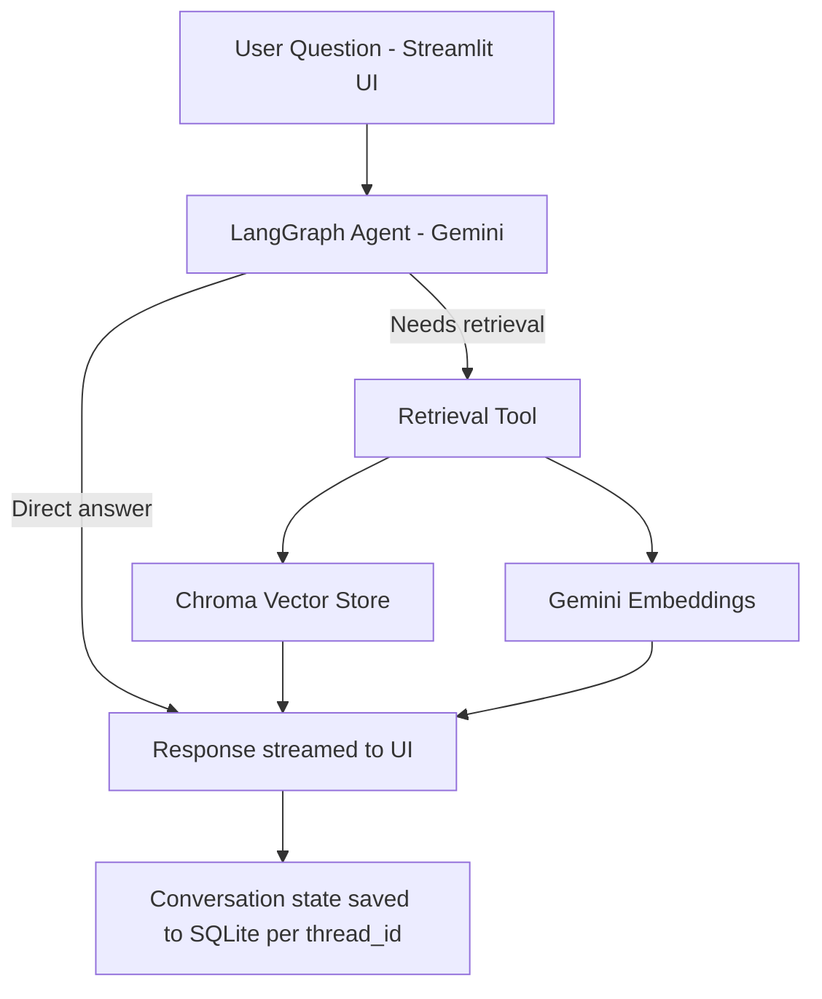

# agentic-rag-chatbot

A conversational AI assistant built with **LangGraph** that combines agentic reasoning with **Retrieval-Augmented Generation (RAG)**. The agent decides when to answer directly and when to retrieve information from a document knowledge base, with full conversation memory persisted across sessions.

## Features

- **Agentic workflow** orchestrated with LangGraph — the LLM decides when to invoke retrieval as a tool rather than always forcing a RAG lookup
- **RAG pipeline** over PDF documents using Chroma as the vector store
- **Persistent conversation memory** via LangGraph's SQLite checkpointer — conversations survive app restarts, keyed by thread ID
- **Streaming responses** in the UI for a responsive, real-time chat experience
- **Streamlit frontend** with chat history and message rendering

## Architecture

## Tech Stack

| Component | Technology |
|---|---|
| Agent orchestration | LangGraph |
| LLM | Google Gemini (`gemini-2.0-flash`) |
| Embeddings | Google Gemini (`text-embedding-004`) |
| Vector store | Chroma |
| Document loading & chunking | LangChain (`PyPDFLoader`, `RecursiveCharacterTextSplitter`) |
| Conversation persistence | LangGraph `SqliteSaver` |
| Frontend | Streamlit |
